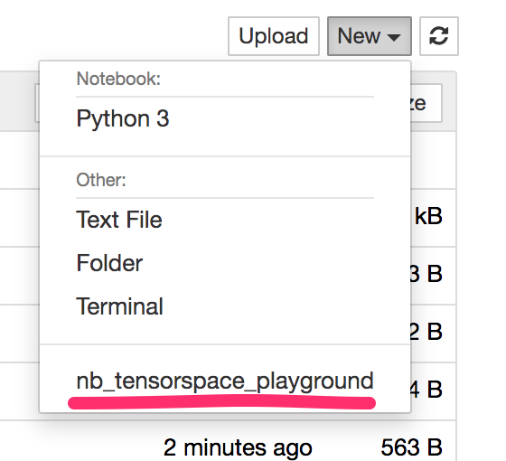

# nb\_tensorspace\_server\_proxy
Simple tensorspace examples wrapped via jupyter-server-proxy

Copy of some of original [Tensorspace playground](https://github.com/tensorspace-team/tensorspace) demos ([original playground](https://tensorspace.org/html/playground/index.html)), run locally under a local web server via `jupyter-server-proxy`.

See also:

- [`nb_tensorflow_playground_serverproxy`](https://github.com/innovationOUtside/nb_tensorflow_playground_serverproxy) which does a similar thing for the *Tensorflow Playground*;
- [Hand-Written-Digit-Recognition](https://github.com/ouseful-PR/Hand-Written-Digit-Recognition), a simple jupyter-server-proxy wrapper for a small MNIST handwritten digit recognition task.
